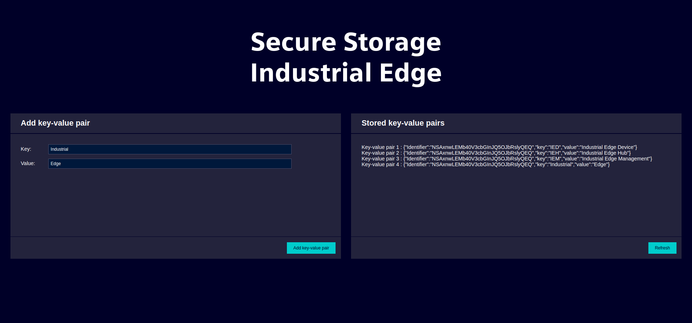

# Secure Storage Industrial Edge

This example describes the IE devices local secure storage database that enables users to encrypt, store, access and manage app data and demonstrates its use on a simple web application.

- [Secure Storage Industrial Edge](#secure-storage-industrial-edge)
  - [Description](#description)
    - [Overview](#overview)
    - [General Task](#general-task)
  - [Requirements](#requirements)
    - [Prerequisites](#prerequisites)
    - [Used components](#used-components)
  - [Installation](#installation)
  - [Usage](#usage)
  - [Implementation](#implementation)
  - [Documentation](#documentation)
  - [Contribution](#contribution)
  - [License and Legal Information](#license-and-legal-information)

## Description

### Overview

The Secure Storage is a local key-value database which enables easy, high performant and secure way for storing the application data. Each application has its own unique key-value store. For communication with this storage the IE Device provides REST API endpoinds. These endpoints can only be called by application container.

The more comprehensive documentation for the Secure Storage API can be found in the official IE Platform Guides - [Secure Storage](https://docs.eu1.edge.siemens.cloud/developer/platform/guides/APIs/secure-storage.html).

For the OpenAPI specification please refer to [IED Secure Storage API Docs](https://docs.eu1.edge.siemens.cloud/developer/platform/references/ied/secure-storage-api.html).

This repository describes the format and endpoints of Industiral Edge Devices Secure Storage API and demonstrates how to use this API in single container running a simple web application.

### General Task

This guide shows how to use Secure Storage API in order to store and retrieve application data in form of key-value pairs. For this task simple web application using core web technologies and flask framework was created. The data are generated by a user using web form and saved on the industrial edge devices. The stored key-value pairs are afterwards retrieved and displayed on the same page.

## Requirements

### Prerequisites

- Access to an Industrial Edge Management (IEM) with onboarded Industrial Edge Device (IED)
- Industrial Edge Device Version &geq; 1.9.x
- Development system with docker and docker compose installed
- Installed Industrial Edge App Publisher
- Google Chrome (Version &geq; 72)

### Used components

- Industrial Edge Management (IEM) V1.5.1-4 / V1.8.6
- Industrial Edge Device (IED) V1.10.0.6
- Industrial Edge App Publisher V1.7.1
- Docker Engine 20.10.21
- Docker Compose V2.12.2

## Installation

You can find further information about the following installation steps in the [docs](./docs).

- [Build application](docs/Installation.md#build-application)
- [Upload application to Industrial Edge Management](docs/Installation.md#upload-secure-storage-app-to-the-industrial-edge-managment)
- [Deploy application to Industrial Edge Device](docs/Installation.md#deploying-of-app)

## Usage

Login to Industrial Edge Device and click on Icon of the Secure Storage Application to open new page in a Browser.

The main content of the application consist of two cards. The first/left card contains a form that is used to add new key-value pair to the applications secure storage. To save new key-value pair to the secure storage, fill in both inputs a click on _Add key-value pair_ button. Messagebox will appear with information whether the action was successful and the data were added or with information about error in case of a problem.

The second/right card displays all stored key-value pairs in their JSON format as they are returned by the Secure Storage API. The newly added data using the first card is not automatically displayed in this section upon creation. For that the user needs to use _Refresh_ button, to re-fetch the information about the stored key-value pairs from the Industrial Edge Device.

## Implementation

How to use web requests to access the functionalities of Secure Storage as well as further details about the source code can be found in the [implementation section](./docs/Implementation.md).

## Documentation

You can find further documentation and help in the following links

- [Industrial Edge Hub](https://iehub.eu1.edge.siemens.cloud/#/documentation)
- [Industrial Edge Forum](https://www.siemens.com/industrial-edge-forum)
- [Industrial Edge Landing page](https://new.siemens.com/global/en/products/automation/topic-areas/industrial-edge/simatic-edge.html)
- [Industrial Edge GitHub page](https://github.com/industrial-edge)

## Contribution

Thank you for your interest in contributing. Anybody is free to report bugs, unclear documentation, and other problems regarding this repository in the Issues section.
Additionally everybody is free to propose any changes to this repository using Pull Requests.

If you are interested in contributing via Pull Request, please check the [Contribution License Agreement](Siemens_CLA_1.1.pdf) and forward a signed copy to [industrialedge.industry@siemens.com](mailto:industrialedge.industry@siemens.com?subject=CLA%20Agreement%20Industrial-Edge).

## License and Legal Information

Please read the [Legal information](LICENSE.txt).
