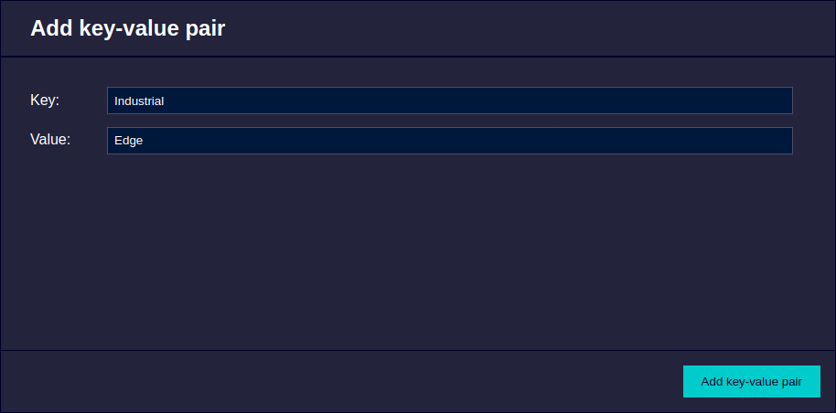

# Secure Storage Industrial Edge

This example describes the IED secure storage database that enables users to encrypt, store, access and manage app data and demonstrates its use on a simple web application.

- [Secure Storage Industrial Edge](#secure-storage-industrial-edge)
  - [Description](#description)
    - [Overview](#overview)
    - [Prerequisites](#prerequisites)
    - [Used components](#used-components)
  - [Installation](#installation)
  - [Usage](#usage)
  - [Implementation](#implementation)
  - [Documentation](#documentation)
  - [Contribution](#contribution)
  - [License and Legal Information](#license-and-legal-information)
  - [Disclaimer](#disclaimer)

## Description

### Overview

The Secure Storage is a local key-value database which enables simple and secure storage of application data. Each application has its own unique key-value store. For communication with this storage the IE Device provides REST API endpoints. These endpoints can only be called from within the application container.

More comprehensive documentation for the Secure Storage API can be found in the official IE Platform Guides - [Secure Storage](https://docs.eu1.edge.siemens.cloud/apis_and_references/apis/api-how-tos/secure-storage.html).

For the OpenAPI specification please refer to [IED Secure Storage API Docs](https://docs.eu1.edge.siemens.cloud/apis_and_references/apis/ied/secure-storage-api-2.0.0.html).

This repository demonstrates how to use this API in a simple web application. The user can generate data using a form webpage, save it in Secure Storage, and also retrieve existing data from it.

### Prerequisites

- Access to an Industrial Edge Management (IEM) with onboarded Industrial Edge Device (IED)
- Industrial Edge Device with IEDK Version &geq; 1.19.0
- Development system with docker and docker compose installed
- Installed Industrial Edge App Publisher
- Google Chrome (Version &geq; 72)

### Used components

- Industrial Edge Management (IEM-V) V2.3.1-1
- Industrial Edge Device (IED) V2.2.0
- Industrial Edge App Publisher V1.17.5
- Docker Engine 27.3.1
- Docker Compose V2.29.7

## Installation

You can find the installation steps in the [docs](./docs).

## Usage

Login to Industrial Edge Device and click on the icon of the Secure Storage Application to open its web UI. The webpage contains a form to put in new data, a button to commit this data to secure storage (with feedback whether this was successful or not), and a way to view the existing key-value pairs.

## Implementation

How to use web requests to access the functionalities of Secure Storage as well as further details about the source code can be found in the [implementation section](./docs/Implementation.md).

## Documentation

You can find further documentation and help in the following links

- [Industrial Edge Hub](https://iehub.eu1.edge.siemens.cloud/#/documentation)
- [Industrial Edge Forum](https://www.siemens.com/industrial-edge-forum)
- [Industrial Edge Landing page](https://new.siemens.com/global/en/products/automation/topic-areas/industrial-edge/simatic-edge.html)
- [Industrial Edge GitHub page](https://github.com/industrial-edge)

## Contribution

Thank you for your interest in contributing. Anybody is free to report bugs, unclear documentation, and other problems regarding this repository in the Issues section.
Additionally everybody is free to propose any changes to this repository using Pull Requests.

If you haven't previously signed the [Siemens Contributor License Agreement](https://cla-assistant.io/industrial-edge/) (CLA), the system will automatically prompt you to do so when you submit your Pull Request. This can be conveniently done through the CLA Assistant's online platform. Once the CLA is signed, your Pull Request will automatically be cleared and made ready for merging if all other test stages succeed.

## License and Legal Information

Please read the [Legal information](LICENSE.txt).

## Disclaimer

IMPORTANT - PLEASE READ CAREFULLY:

This documentation describes how you can download and set up containers which consist of or contain third-party software. By following this documentation you agree that using such third-party software is done at your own discretion and risk. No advice or information, whether oral or written, obtained by you from us or from this documentation shall create any warranty for the third-party software. Additionally, by following these descriptions or using the contents of this documentation, you agree that you are responsible for complying with all third party licenses applicable to such third-party software. All product names, logos, and brands are property of their respective owners. All third-party company, product and service names used in this documentation are for identification purposes only. Use of these names, logos, and brands does not imply endorsement.
