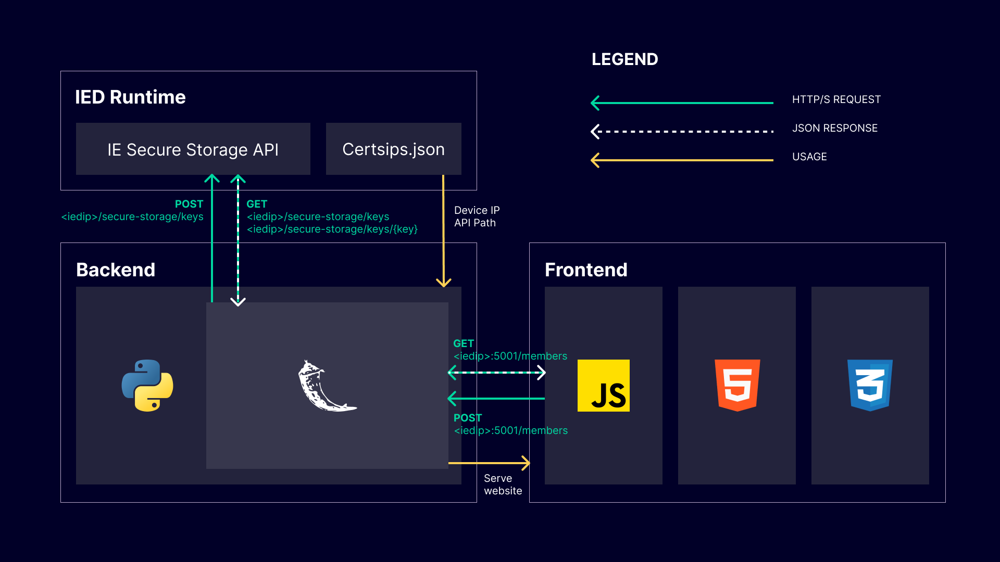
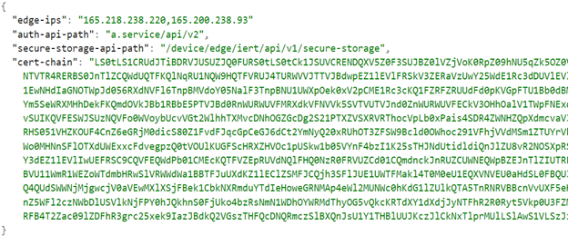

# Implementation

- [Implementation](#implementation)
  - [Overview](#overview)
  - [Secure Storage API Interactions](#secure-storage-api-interactions)
    - [Mount Point](#mount-point)
    - [Adding new key-value pair to secure storage](#adding-new-key-value-pair-to-secure-storage)
    - [Retrieving existing key value pairs](#retrieving-existing-key-value-pairs)
    - [API Specification](#api-specification)

## Overview

The following image describes the complete structure of the implemented application and communication in between the application parts and Industrial Edge Device runtime.

The general interaction flow is as follows. The user interacts with the web-page (front-end) using displayed form and buttons. Those buttons are tied to functions in java-script code that sends HTTP requests to Flask backend on /members endpoint. Flask then forward these request to approriate Secure Storage API endpoints in the IED runtime.



## Secure Storage API Interactions
### Mount Point
Because the REST API uses HTTPS, certificates are required for secure communication. A mount point is used to provide the endpoint and any relevant trusted certificates to the application.

The existing mount point has a JSON file that is filled with available certificates, IP addresses, and the Auth API and Secure Storage API paths needed to conduct the REST call. It can be found in all application containers at `/var/run/edgedevice/certsips.json.`

In this application example the mountpoint is loaded in backend in [main.py](./../src/main.py) file. From this mountpoint the device IP and API path is extracted and used to construct the REST calls.

The structure of the `certsips.json` file looks like this:


### Adding new key-value pair to secure storage
To add new key-value pair to applications secure storage an POST request with the necessary data is send to `/secure-storage/keys` endpoint. This endpoint expects a key and value in a body of the request. Therefore first in the backend the check is made to see if the user provided required information. If key or value is missing, an error message is send back. Otherwise the POST request is made and information whether adding of new key-value pair was succesfull is send back to the user in the response.

```python
# Get the data from the post request
data = json.loads(request.data)

# Convert the data to the JSON string
body = json.dumps(data)

# If the post data payload does not contain key and value; respond with error message
if not 'key' in data or not 'value' in data or data['key'] == '' or data['value'] == '':
    return Response(json.dumps({
        "errors": [
            {
                "message": "You must specify key and value"
            }
        ]
    }), status=400)

# Add the key-value pair to secure storage
response_post = requests.request("POST", (BASE_URL + "/keys"), data=body, headers=HEADERS, verify=False)

# If the reponse code == 201, adding was succesfull; send a confirmation message
if response_post.status_code == 201:
    return Response('Successfully added a member', status=201)
else:
    # In case of an error; send an response with error description
    return Response(json.dumps(response_post.json()), status=response_post.status_code)

```
### Retrieving existing key value pairs
To retrieve all existing members with their values, two separate calls to the Secure Storage API needs to be done. First a get request to the `/secure-storage/keys` endpoint is made. This returns JSON payload containing list of all keys of added key-value pairs for the application. This list is then used in loop to call `/secure-storage/keys/{key}` endpoint with specific keys, to get the value for that key and costruct the response. 

```python
# Prepare key_value_pairs list for response
key_value_pairs = []

# Get all available keys from secure storage
response = requests.request("GET", (BASE_URL + "/keys"), headers=HEADERS, verify=False).json()

# If response does not contain securestoragekeys (secure storage is empty); return empty response
if not response["securestoragekeys"]:
    return Response({})

# For each an every key call the keys endpoint to get the value
for element in response["securestoragekeys"]:
    response_call = requests.request("GET", (BASE_URL + "/keys/" + element), headers=HEADERS,verify=False).json()
    # Add the values to response list
    key_value_pairs.append(response_call)

# Return the complete list of all members in secure storage
return Response(json.dumps(key_value_pairs))
```

### API Specification
For all available Secure Storage API Endpoints, their format, input and output values, please refer to the [IED Secure Storage OpenAPI Specification](https://docs.eu1.edge.siemens.cloud/developer/platform/references/ied/secure-storage-api.html).