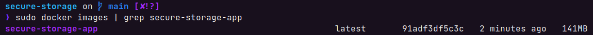

# Installation

- [Installation](#installation)
  - [Build the application](#build-the-application)
    - [Clone the image](#clone-the-image)
    - [Build the docker image](#build-the-docker-image)
  - [Upload the Secure Storage App to the Industrial Edge Management](#upload-the-secure-storage-app-to-the-industrial-edge-management)
    - [Connect your Industrial Edge App Publisher](#connect-your-industrial-edge-app-publisher)
    - [Upload the Secure Storage App using the Industrial Edge App Publisher](#upload-the-secure-storage-app-using-the-industrial-edge-app-publisher)
  - [Deploy the App](#deploy-the-app)

## Build the application

### Clone the image

- Clone or Download the source code to your engineering VM

### Build the docker image

- Open the console in the source code folder
- Use the command `docker compose build` to create the docker image.
- This docker image can now be used to build you app with the Industrial Edge App Publisher
- `docker images | grep secure-storage-app` can be used to check for the images
- You should get a result similar to this:

  

## Upload the Secure Storage App to the Industrial Edge Management

Please find below a short description how to publish your application in your IEM.

For more detailed information please see the section for [uploading apps to the IEM](https://github.com/industrial-edge/upload-app-to-iem).

### Connect your Industrial Edge App Publisher

- Connect your Industrial Edge App Publisher to your Docker engine
- Connect your Industrial Edge App Publisher to your Industrial Edge Management system

### Upload the Secure Storage App using the Industrial Edge App Publisher

- Create a new application using the IEAP
- Add a new app version
- Import the [docker-compose](../docker-compose.yml) file using the **Import YAML** button
- The warning `Build (services >> scanner-service) is not supported` can be ignored
- **Start Upload** to transfer the app to Industrial Edge Management
- Further information about using the Industrial Edge App Publisher can be found in the [IE Hub](https://iehub.eu1.edge.siemens.cloud/documents/appPublisher/en/start.html)

## Deploy the App

Select the uploaded version of the application and install it on the desired Industrial Edge Device.
